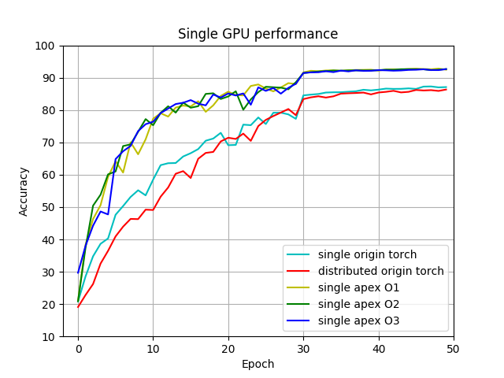
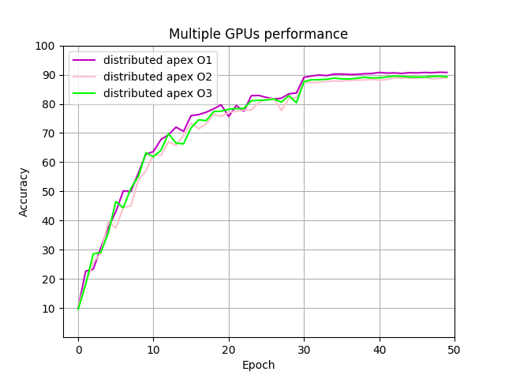
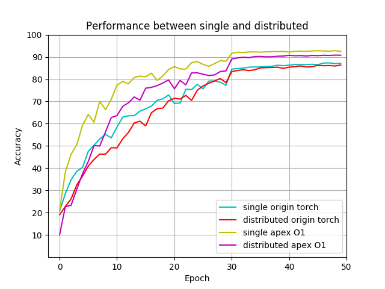

# Experiment

## Usage of NVIDIA Docker

Pull the PyTorch Image

```bash
$ sudo docker pull nvcr.io/nvidia/pytorch:19.06-py3
```

1. **Interactive mode:** Open a command prompt and issue:

   ```
   nvidia-docker run -it --rm -v local_dir:container_dir 
   nvcr.io/nvidia/pytorch:<xx.xx>-py3
   ```

2. **Non-interactive mode:** Open a command prompt and issue:

   ```
   nvidia-docker run --rm -v local_dir:container_dir 
   nvcr.io/nvidia/pytorch:<xx.xx>-py3 <command>
   ```

## VGG16 on CIFAR10

1. Run the interactive mode:

   ```bash
   $ sudo nvidia-docker run -it --rm -v /home/leafz/PyTorch-Learning:/workspace nvcr.io/nvidia/pytorch:19.06-py3
   ```

2. Run the Non-interactive mode:

   ```bash
   $ sudo nvidia-docker run --rm -v /home/leafz/PyTorch-Learning:/workspace nvcr.io/nvidia/pytorch:19.06-py3 python /workspace/src/vgg_p.py
   ```

Both of the above commands meet the error:

```bash
NOTE: The SHMEM allocation limit is set to the default of 64MB.  This may be
   insufficient for PyTorch.  NVIDIA recommends the use of the following flags:
   nvidia-docker run --ipc=host ...

Files already downloaded and verified
Let's use 4 GPUs!
start train

Traceback (most recent call last):
  File "/workspace/src/vgg_p.py", line 58, in <module>
    outputs = net(inputs)
  File "/opt/conda/lib/python3.6/site-packages/torch/nn/modules/module.py", line 494, in __call__
    result = self.forward(*input, **kwargs)
  File "/opt/conda/lib/python3.6/site-packages/torch/nn/parallel/data_parallel.py", line 152, in forward
    outputs = self.parallel_apply(replicas, inputs, kwargs)
  File "/opt/conda/lib/python3.6/site-packages/torch/nn/parallel/data_parallel.py", line 162, in parallel_apply
    return parallel_apply(replicas, inputs, kwargs, self.device_ids[:len(replicas)])
  File "/opt/conda/lib/python3.6/site-packages/torch/nn/parallel/parallel_apply.py", line 83, in parallel_apply
    raise output
  File "/opt/conda/lib/python3.6/site-packages/torch/nn/parallel/parallel_apply.py", line 59, in _worker
    output = module(*input, **kwargs)
  File "/opt/conda/lib/python3.6/site-packages/torch/nn/modules/module.py", line 494, in __call__
    result = self.forward(*input, **kwargs)
  File "/opt/conda/lib/python3.6/site-packages/torchvision/models/vgg.py", line 44, in forward
    x = self.classifier(x)
  File "/opt/conda/lib/python3.6/site-packages/torch/nn/modules/module.py", line 494, in __call__
    result = self.forward(*input, **kwargs)
  File "/opt/conda/lib/python3.6/site-packages/torch/nn/modules/container.py", line 92, in forward
    input = module(input)
  File "/opt/conda/lib/python3.6/site-packages/torch/nn/modules/module.py", line 494, in __call__
    result = self.forward(*input, **kwargs)
  File "/opt/conda/lib/python3.6/site-packages/torch/nn/modules/linear.py", line 92, in forward
    return F.linear(input, self.weight, self.bias)
  File "/opt/conda/lib/python3.6/site-packages/torch/nn/functional.py", line 1403, in linear
    ret = torch.addmm(bias, input, weight.t())
RuntimeError: size mismatch, m1: [400 x 512], m2: [25088 x 4096] at /tmp/pip-req-build-hlju8y6w/aten/src/THC/generic/THCTensorMathBlas.cu:273
```

Then I add the `—-ipc=host` to the commands:

```bash
$ sudo nvidia-docker run -it --ipc=host --rm -v /home/leafz/PyTorch-Learning:/workspace nvcr.io/nvidia/pytorch:19.06-py3
```

```bash
$ sudo nvidia-docker run --ipc=host --rm -v /home/leafz/PyTorch-Learning:/workspace nvcr.io/nvidia/pytorch:19.06-py3 python /workspace/src/vgg_p.py
```

Still have the error. Noticed that this scipt can be successfully run outside.

After reading the source code of vgg model: `python3.6/site-packages/torchvision/models/vgg.py`, I found the cause of the problem.

In the docker, python use `torchvision 0.2.1`, but the host is `torchvision 0.3.0`. There is a little difference between the two implement of the vgg model:

```python
# vgg.py of torchvision 0.3.0

    def forward(self, x):
        x = self.features(x)
        x = self.avgpool(x)
        x = x.view(x.size(0), -1)
        x = self.classifier(x)
        return 
      
# vgg.py of torchvision 0.2.1

    def forward(self, x):
        x = self.features(x)
        x = x.view(x.size(0), -1)
        x = self.classifier(x)
        return 
```

An `avgpool` added in the new version, it make the output of the `self.features(x)` from the size `([batch_size, 512, *, *])` to `([batch_size, 512, 7, 7])`. So that it can fit the input size of the `self.classifier(x)` after the flat by `x.view(x.size(0), -1)`.

In my script, I used the CIFAR10 dataset, which data size is `([batch_size, 3, 32, 32])`. It need to be resize to `([batch_size, 512, 7, 7])`, or will raise the above error.

To solve the problem, update the torchvision in the docker:

```bash
$ conda install torchvision -c pytorch
```

Then, the script can be run correctly. But it's too slow in the docker.

## resnet50 on ImageNet

### Host

#### Single GPU

**256 batch size**

```bash
$ python main.py -a resnet50 --epochs 1 --gpu 0 ../../imagenet
```

Parameters: `batch-size: 256`, `workers: 4`, `lr: 0.01`

Result: `Acc@1 16.016 Acc@5 36.080`, `Time 0.742 @5005`

Details in `log/resnet_s_256.log` 

**128 batch size**

```bash
$ python main.py -a resnet50 --epochs 1 --batch-size 128 --gpu 0 ../../imagenet
```

Parameters: `batch-size: 128`, `workers: 4`, `lr: 0.01`

Result: `Acc@1 16.528 Acc@5 36.420`, `Time 0.376 @10010`

Details in `log/resnet_s_128.log` 

#### Data Parallel

**256 batch size**

```bash
$ python main.py -a resnet50 --epochs 1 ../../imagenet
```

Parameters: `batch-size: 256`, `workers: 16`, `lr: 0.01`

Result: `Acc@1 15.004 Acc@5 33.876`, `Time 0.378 @5005`

Details in `log/resnet_p_256.log` 

**1024 batch size**

```bash
$ python main.py -a resnet50 --epochs 1 --batch-size 1024 --workers 16 ../../imagenet
```

Parameters: `batch-size: 1024`, `workers: 16`, `lr: 0.01`

Result: `Acc@1 10.772 Acc@5 26.926`, `Time 0.802 @1252`

Details in `log/resnet_p_1024.log` 

#### Distributed Data Parallel (Single node, 4 GPUs)

**256 batch size**

```bash
$ python main.py -a resnet50 --epochs 1 --batch-size 256 --dist-url 'tcp://127.0.0.1:2345' --dist-backend 'nccl' --multiprocessing-distributed --world-size 1 --rank 0 ../../imagenet
```

Parameters: `batch-size: 256`, `workers: 4`, `lr: 0.01`

Result: `Acc@1 14.990 Acc@5 33.922`, `Time 0.396 @5005`

Details in `log/resnet_d_256.log` 

**1024 batch size**

```bash
$ python main.py -a resnet50 --epochs 1 --batch-size 1024 --workers 16 --dist-url 'tcp://127.0.0.1:2345' --dist-backend 'nccl' --multiprocessing-distributed --world-size 1 --rank 0 ../../imagenet
```

Parameters: `batch-size: 1024`, `workers: 16`, `lr: 0.01`

Result: `Acc@1 11.296 Acc@5 27.850`, `Time 0.794 @1252`

Details in `log/resnet_d_1024.log` 

#### Some thoughts about the results

When I set a small batch size $a$ and a number of iteration $b$ , versus a large batch size $c$ and a number of iteration $d$ where $ab = cd$ . I find that after being trained for a same number of ephoc, the model with small batch size always performs better and the model with large batch size could be trained faster. I found a paper [On Large-Batch Training for Deep Learning: Generalization Gap and Sharp Minima](https://arxiv.org/abs/1609.04836) and a question [Tradeoff batch size vs. number of iterations to train a neural network](https://stats.stackexchange.com/questions/164876/tradeoff-batch-size-vs-number-of-iterations-to-train-a-neural-network) about that.

The above thoughts of the batch size are about the training on a single GPU. As for single GPU versus multiple GPUs, there are something should be noticed. The following picture is about how `DataParallel` works. 


The summary of each step is:

1. Default GPU split the batch to the four part and scatter to the other GPUs
2. Each GPU copy the model from the default GPU
3. Each GPU forward the input and get the output
4. Gather the output to the default GPU. Default GPU compute the respective loss and scatter the losses to the other GPUs
5. Each GPU computer their gradients
6. Default GPU sum up the gradients and then update the model

Because the gradient of the multiple GPUs is the sum of the each GPU's gradient, The training model on the multiple GPUs should compare with the model with same batch size on the single GPU. So the steps which can be speed up of the training procedure are the forward compute and gradient compute. Under this condition, the speedup depends on the proportion of the above two steps in the entire process.

For example, we can compute the approximate speedup of the 4 GPUs with `batch-size=256`:
$$
speedup = \frac{0.742}{0.378} = 1.963
$$
It's just a speedup of `DataParallel` implementation by PyTorch in **4** GPUs.

### NVIDIA Docker

**Single GPU**

```bash
$ sudo nvidia-docker run --ipc=host --rm -v /home:/workspace nvcr.io/nvidia/pytorch:19.06-py3 python /workspace/leafz/PyTorch-Learning/imagenet_src/main.py -a resnet50 --epochs 1 --gpu 0 /workspace/leafz/imagenet
```

Parameters: `batch-size: 256`, `workers: 4`, `lr: 0.01`

Result: `Acc@1 14.856 Acc@5 34.670`, `Time 0.703 @5005`

Details in `log/resnet_s_256_docker.log` 

**Data Parallel**

```bash
$ sudo nvidia-docker run --ipc=host --rm -v /home:/workspace nvcr.io/nvidia/pytorch:19.06-py3 python /workspace/leafz/PyTorch-Learning/imagenet_src/main.py -a resnet50 --epochs 1 /workspace/leafz/imagenet
```

Parameters: `batch-size: 256`, `workers: 4`, `lr: 0.01`

Result: `Acc@1 17.406 Acc@5 38.240`, `Time 0.284 @5005`

Details in `log/resnet_p_256_docker.log` 

**Distributed Data Parallel (Single node, 4 GPUs)**

```bash
$ sudo nvidia-docker run --ipc=host --rm -v /home:/workspace nvcr.io/nvidia/pytorch:19.06-py3 python /workspace/leafz/PyTorch-Learning/imagenet_src/main.py -a resnet50 --epochs 1 --dist-url 'tcp://127.0.0.1:2345' --dist-backend 'nccl' --multiprocessing-distributed --world-size 1 --rank 0 /workspace/leafz/imagenet
```

Parameters: `batch-size: 256`, `workers: 4`, `lr: 0.01`

Result: `Acc@1 18.440 Acc@5 40.55`, `Time 0.307 @5005`

Details in `log/resnet_d_256_docker.log` 

#### Result Analyze

Because the version of cuDNN in the host is 7.3 versus the version 7.6 in the docker, the training speed has been significantly imporved.

Same as Host, the parallel speedup between single GPU and 4 GPUs in data parallel is:
$$
speedup_p = \frac{0.703}{0.284} = 2.475
$$
and the speedup between single GPU and 4 GPUs in distributed data parallel is:
$$
speedup_d = \frac{0.703}{0.307} = 2.290
$$

## Mixed Precision

Test script from [Mixed Precision ImageNet Training in PyTorch](https://github.com/NVIDIA/apex/tree/master/examples/imagenet)

It provides four options to the precision:

- `—-opt-level O0`: Pure FP32 training
- `—-opt-level O1`: Conservative mixed precision. Insert automatic casts around Pytorch functions and Tensor methods
- `—-opt-level O2`: Fast mixed precision, FP16 training with FP32 batchnorm and FP32 master weights
- `—-opt-level O3`: Pure FP16 training

It supports single GPU training and distributed data parallel training. The following trainings are all in the NVIDIA docker.

### Single GPU

Enter the PyTorch container:

```bash
$ sudo nvidia-docker run -it --ipc=host --rm -v /home:/workspace nvcr.io/nvidia/pytorch:19.06-py3

$ cd leafz/PyTorch-Learning/mixed_precision
```

Use `CUDA_VISIBLE_DEVICES` in each docker container to specify which GPU to use

```bash
$ export CUDA_VISIBLE_DEVICES=1, 2 		# Use GPU 1 & 2
```

So I can open four container to run four single GPU training at the same time.

#### `--opt-level O0`

```bash
$ python main_amp.py -a resnet50 --b 256 --epochs 1 --workers 4 --opt-level O0 ./
```

Result: `Prec@1 7.822 Prec@5 20.642`, `Time 0.688 @5005`, `Speed 372.098`

#### `--opt-level O1`

```bash
$ python main_amp.py -a resnet50 --b 256 --epochs 1 --workers 4 --opt-level O1 ./
```

Result: `Prec@1 9.118 Prec@5 24.084`, `Time 0.324 @5005`, `Speed 791.178`

#### `--opt-level O2`

```bash
$ python main_amp.py -a resnet50 --b 256 --epochs 1 --workers 4 --opt-level O2 ./
```

Result: `Prec@1 8.282 Prec@5 22.202`, `Time 0.321 @5005`, `Speed 796.925`

#### `--opt-level O3` & `--keep-batchnorm-fp32 True`

```bash
$ python main_amp.py -a resnet50 --b 256 --epochs 1 --workers 4 --opt-level O3 --keep-batchnorm-fp32 True ./
```

Result: `Prec@1 9.126 Prec@5 24.084`, `Time 0.311 @5005`, `Speed 824.450`

#### Result Analyze

The single GPU speedup by mixed precision as follows:
$$
speedup = \frac{0.688}{0.311} = 2.212
$$
There is small difference between the last three options. And the result of speedup is very significant.

### Distributed training (4 GPUs)

#### `--opt-level O0`

```bash
$ python -m torch.distributed.launch --nproc_per_node=4 main_amp.py -a resnet50 --b 256 --epochs 1 --workers 4 --opt-level O0 ./
```

Result: `Prec@1 6.944 Prec@5 18.470`, `Time 0.706 @1252`, `Speed 1450.651`

#### `--opt-level O1`

```bash
$ python -m torch.distributed.launch --nproc_per_node=4 main_amp.py -a resnet50 --b 256 --epochs 1 --workers 4 --opt-level O1 ./
```

Result: `Prec@1 7.280 Prec@5 19.612`, `Time 0.337 @1252`, `Speed 3039.582`

#### `--opt-level O2`

```bash
$ python -m torch.distributed.launch --nproc_per_node=4 main_amp.py -a resnet50 --b 256 --epochs 1 --workers 4 --opt-level O2 ./
```

Result: `Prec@1 7.190 Prec@5 18.744`, `Time 0.334 @1252`, `Speed 3063.879`

#### `--opt-level O3` & `--keep-batchnorm-fp32 True`

```bash
$ python -m torch.distributed.launch --nproc_per_node=4 main_amp.py -a resnet50 --b 256 --epochs 1 --workers 4 --opt-level O3 --keep-batchnorm-fp32 True ./
```

Result: `Prec@1 6.806 Prec@5 18.942`, `Time 0.323 @1252`, `Speed 3172.385`

#### Result Analyze

As for multiple GPUs, speedup by mixed precision as follows:
$$
speedup = \frac{3172.385}{1450.651} = 2.187
$$

The distributed training used `apex.parallel.DistributedDataParallel` rather than `torch.nn.parallel.DistributedDataparallel`. It seems that the speedup of parallelism of `apex` is much better than `torch.nn.`. The speedup roughly equals the number of GPU. It's amazing!

The performance of training in the first epoch is not as good as the fomal one, because the apex uses the strategy of warm up for adjusting learning rate. The learning rate for apex start from a very small value rather than 0.1 in torch official example.

Regardless of the performance of the first epoch, **the speedup of 4 GPUs with mixed precision to single GPU without mixed precision roughly equals 8!** And in the following part, we can see that the accuracy of apex models is also better than the original torch models.

## Performance Test

In this section, I will test the speed of convergence between apex and torch original example. The deferences between the two models are the learning rate and the use of mixed precision.

To get the result in a short time, CIFAR10 is selected to be the training set. Run the each model for 50 epochs and plot the result to see the performance directly.

### Run torch

Modified the source file of torch imagenet example `main.py` to `main_cifar.py`

**Single GPU**

```bash
$ python main_cifar.py -a resnet50 --epochs 50 --gpu 0 ./
```

Results in `log/speed/resnet_s_cifar.log`

**Distributed (4 GPUs)**

```bash
$ python main_cifar.py -a resnet50 --epochs 50 --batch-size 256 --dist-url 'tcp://127.0.0.1:2345' --dist-backend 'nccl' --multiprocessing-distributed --world-size 1 --rank 0 ./
```

Results in `log/speed/resnet_d_cifar.log`

### Run apex

Modified the source file of apex example `main_amp.py` to `main_amp_cifar.py`

#### `--opt-level O1`

**Single GPU**

```bash
$ python main_amp_cifar.py -a resnet50 --b 256 --epochs 50 --workers 4 --opt-level O1 ./
```

Results in `log/speed/mixed_resnet_s_O1_cifar.log` 

**Distributed (4 GPUs)**

```bash
$ python -m torch.distributed.launch --nproc_per_node=4 main_amp_cifar.py -a resnet50 --b 256 --epochs 50 --workers 4 --opt-level O1 ./
```

Results in `log/speed/mixed_resnet_d_O1_cifar.log`

#### `--opt-level O2`

**Single GPU**

```bash
$ python main_amp_cifar.py -a resnet50 --b 256 --epochs 50 --workers 4 --opt-level O2 ./
```

Results in `log/speed/mixed_resnet_s_O2_cifar.log`

**Distributed (4 GPUs)**

```bash
$ python -m torch.distributed.launch --nproc_per_node=4 main_amp_cifar.py -a resnet50 --b 256 --epochs 50 --workers 4 --opt-level O2 ./
```

Results in `log/speed/mixed_resnet_d_O2_cifar.log`

#### `--opt-level O3` & `--keep-batchnorm-fp32 True`

**Single GPU**

```bash
$ python main_amp_cifar.py -a resnet50 --b 256 --epochs 50 --workers 4 --opt-level O3 --keep-batchnorm-fp32 True ./
```

Results in `log/speed/mixed_resnet_s_O3_cifar.log`

**Distributed (4 GPUs)**

```bash
$ python -m torch.distributed.launch --nproc_per_node=4 main_amp_cifar.py -a resnet50 --b 256 --epochs 50 --workers 4 --opt-level O3 --keep-batchnorm-fp32 True ./
```

Results in `log/speed/mixed_resnet_d_O3_cifar.log`

### Result Analyze

#### Single GPU

Plot the result of accuracy versus epoch:



The first figure shows the performance of single GPU. We can see that the apex model converges faster than the original torch model on single GPU. This may be because apex model's strategy of adjusting learning rate is better than the original torch model, which is quite simple. And the result after convergence is also better than the original torch model.

The defference between three options of apex is quite small. And the convergence speed of single original torch model is a little faster than distributed, but they reach the roughly same accuracy after convergence.

#### Multiple GPUs



We can see that there is nearly no difference between the three options of apex. They all reached a ok accuracy versus the best result I found on the internet, which model is resnet50 and the accuracy is 93.1% in 200 epochs on CIFAR10.

#### Single GPU vs. Multiple GPUs



From this figure, we can see that the apex models perform better than original torch models. The apex models' speed and the finial accuracy both better than the original torch models'.

