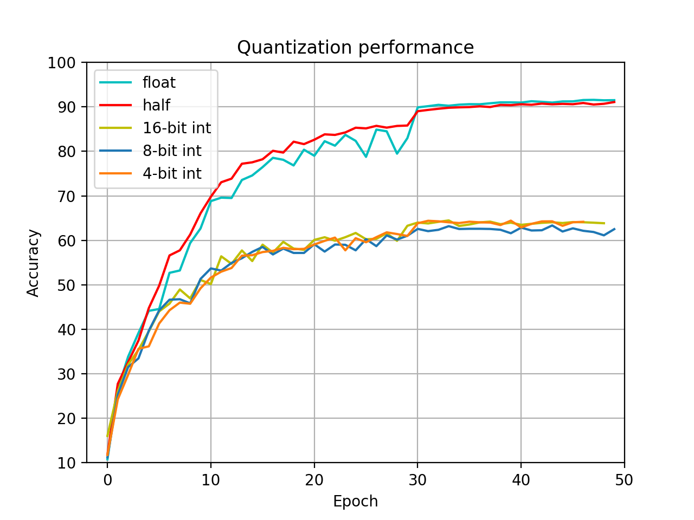

# Quantization

## Quantize weight and input

To quantize the weight of the net, we can use `model.state_dict()` to get the weight and bias of the net, and modify the value of them. After the changes, we can use `model.load_state_dict(state)` to load the new weights and biases. But it is necessary to clone a new model, otherwise the training will be interrupted  because of the loading data. The following is the related code:

```python
    model_q = copy.deepcopy(model)
    state = model.state_dict()
    state_dict_quant = OrderedDict()

    for k, v in state.items():
        v_quant = v

        if 'features' in k:     # conv layer
            v_quant = quant.linear_quantize(v, args.linear_bits)
        
        if 'classifier' in k:   # linear layer
            v_quant = quant.linear_quantize(v, args.conv_bits)

        if 'running' in k:
            state_dict_quant[k] = v
            continue
            
        if v.nelement() != 0:
            v_quant = quant.linear_quantize(v, args.linear_bits)

        state_dict_quant[k] = v_quant
    
    model_q.load_state_dict(state_dict_quant)
```

But there is a problem stops me, the weight after training is mostly decimal. After convert it to `int8`, all of the weights turn to zero, and the inference can not work at all. To solve this problem, I firstly normalize the data to [0, 1], then I expand the range to $[-2^{bits - 1}, 2^{bits - 1} - 1]$.

Quantization of a tensor is implemented in `linear_quantize`:

```python
import torch
import math

def linear_quantize(input, bits):
    
    range1 = input.max() - input.min()
    temp = (input - input.min()) / range1
    
    range2 = math.pow(2.0, bits) - 1
    min_v = - math.pow(2.0, bits - 1)
    ret = (temp.float() * range2) + min_v
    ret = ret.float()

    return ret
```

First, the input is scaled to $[-2^{bits - 1}, 2^{bits - 1} - 1]$. Then, use `int()` remove the decimal. After that, use `float()` change the to the data type which supported in GPU.

## Integer

In this part, I use the above `linear_quantize` function to handle all the weight and bias. As for input data, I process it using `input.int().float()` 

### Run Docker

```bash
$ sudo nvidia-docker run -it --ipc=host --rm -v /home:/workspace nvcr.io/nvidia/pytorch:19.06-py3

$ cd leafz/PyTorch-Learning/quantization
```

### 16 bit

```bash
$ python -m torch.distributed.launch --nproc_per_node=4 resnet_q.py -a resnet50 --b 256 --epochs 50 --workers 4 --opt-level O2 --conv-bits 16 --linear-bits 16 ./
```

Final epoch: `Prec@1 63.850 Prec@5 93.800`

### 8 bit

```bash
$ python -m torch.distributed.launch --nproc_per_node=4 resnet_q.py -a resnet50 --b 256 --epochs 50 --workers 4 --opt-level O2 --conv-bits 8 --linear-bits 8 ./
```

Final epoch: `Prec@1 62.520 Prec@5 93.030`

### 4 bit

```bash
$ python -m torch.distributed.launch --nproc_per_node=4 resnet_q.py -a resnet50 --b 256 --epochs 50 --workers 4 --opt-level O2 --conv-bits 4 --linear-bits 4 ./
```

Final epoch: `Prec@1 64.170 Prec@5 93.820`

##Float

In this part, I remove the `int()` to get a result of control group in order to see how much influence decimal has on the above results.

### 16 bit

I change all the data type to the half in this part:

```bash
$ python -m torch.distributed.launch --nproc_per_node=4 resnet_q.py -a resnet50 --b 256 --epochs 50 --workers 4 --opt-level O2 --conv-bits 16 --linear-bits 16 ./
```

Finial epoch: `Prec@1 91.090 Prec@5 99.660`

## Result

I plot the result of float, half, 4-bit int, 8-bit int and 16-bit int:



We can see that the accuracy of int are quite low. And the differences between several int are very small. I think the decimal should not influence so much.