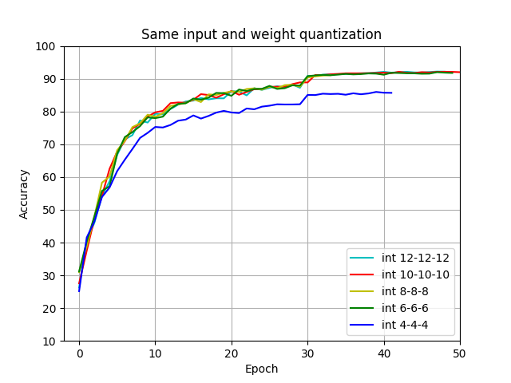
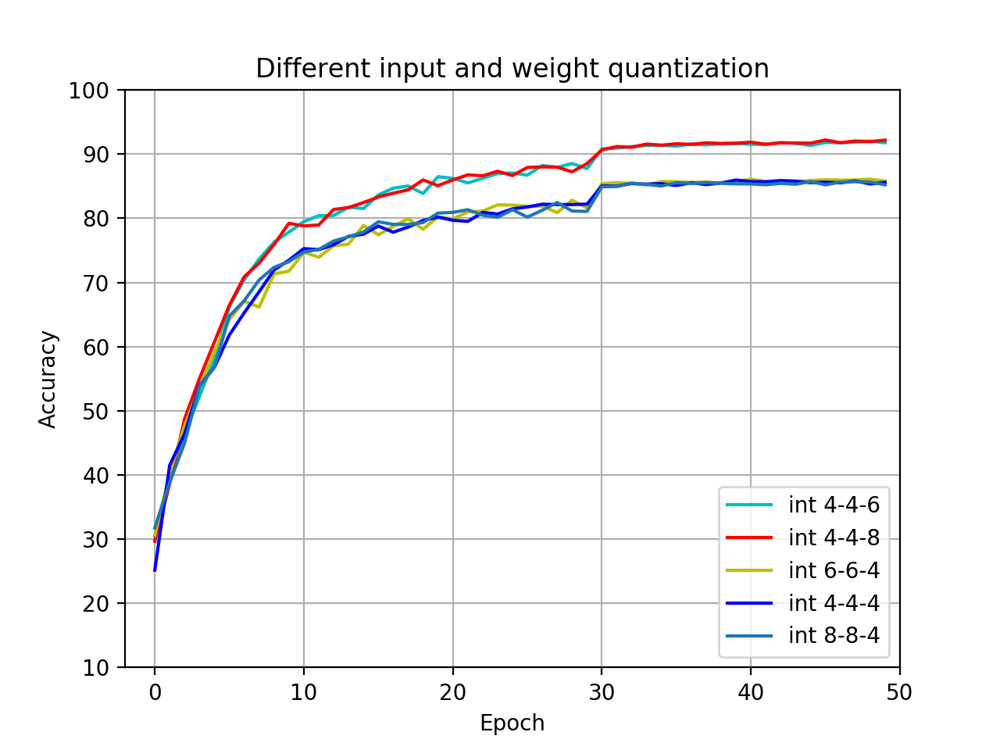
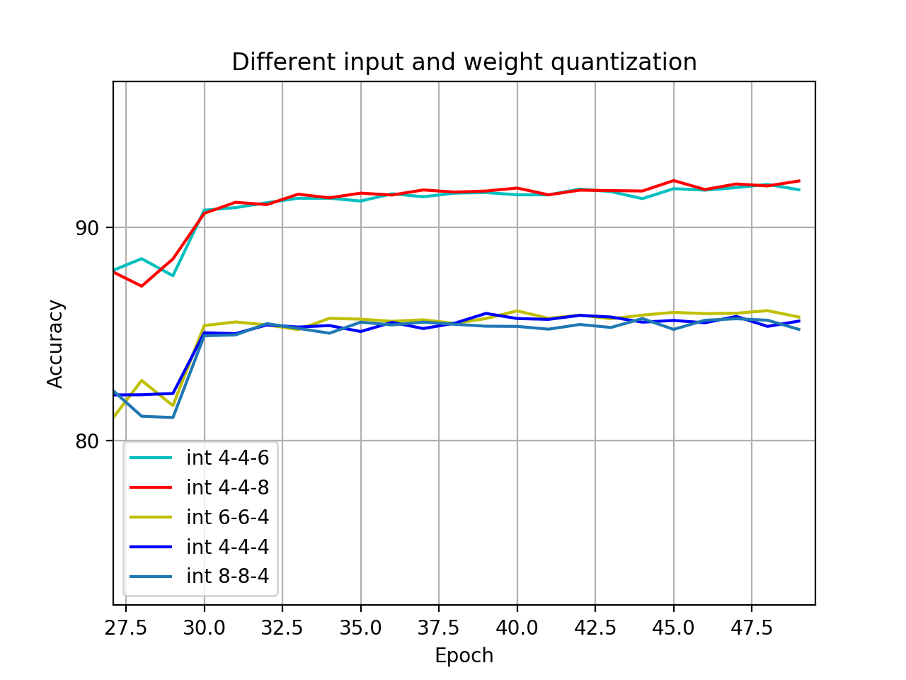
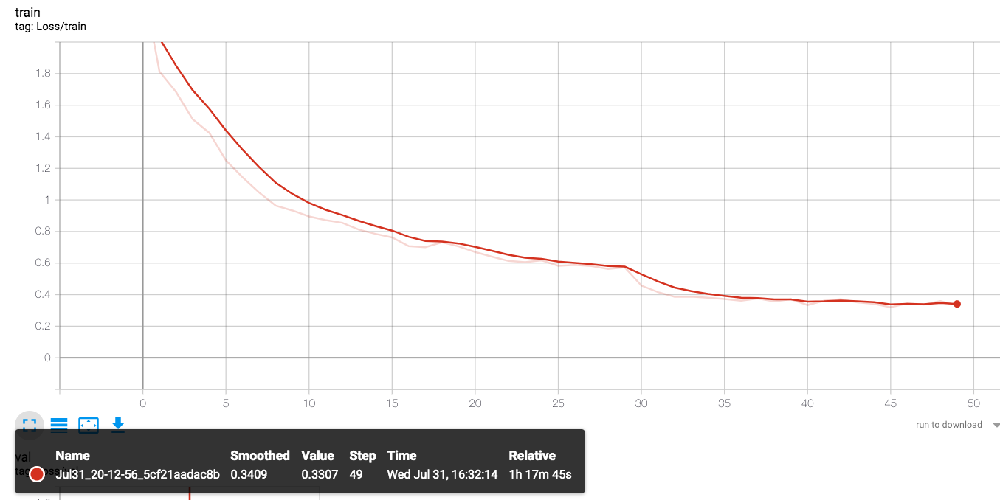
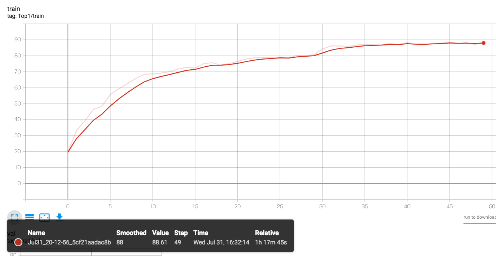
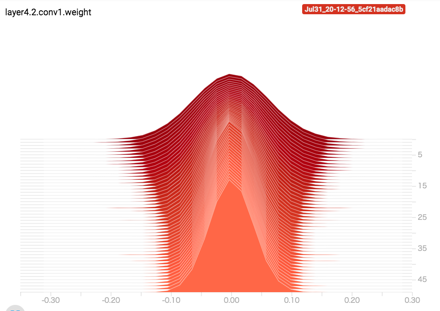
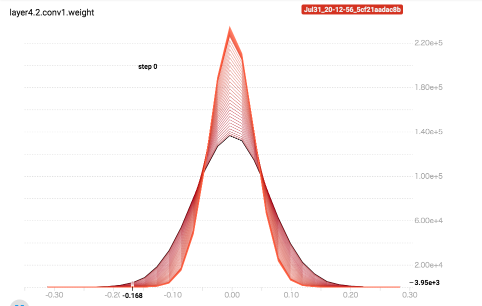

# Quantization

## First try

### Quantize weight and input

To quantize the weight of the net, we can use `model.state_dict()` to get the weight and bias of the net, and modify the value of them. After the changes, we can use `model.load_state_dict(state)` to load the new weights and biases. But it is necessary to clone a new model, otherwise the training will be interrupted  because of the loading data. The following is the related code:

```python
    model_q = copy.deepcopy(model)
    state = model.state_dict()
    state_dict_quant = OrderedDict()

    for k, v in state.items():
        v_quant = v

        if 'features' in k:     # conv layer
            v_quant = quant.linear_quantize(v, args.linear_bits)
        
        if 'classifier' in k:   # linear layer
            v_quant = quant.linear_quantize(v, args.conv_bits)

        if 'running' in k:
            state_dict_quant[k] = v
            continue
            
        if v.nelement() != 0:
            v_quant = quant.linear_quantize(v, args.linear_bits)

        state_dict_quant[k] = v_quant
    
    model_q.load_state_dict(state_dict_quant)
```

But there is a problem stops me, the weight after training is mostly decimal. After convert it to `int8`, all of the weights turn to zero, and the inference can not work at all. To solve this problem, I firstly normalize the data to [0, 1], then I expand the range to $[-2^{bits - 1}, 2^{bits - 1} - 1]$.

Quantization of a tensor is implemented in `linear_quantize`:

```python
import torch
import math

def linear_quantize(input, bits):
    
    range1 = input.max() - input.min()
    temp = (input - input.min()) / range1
    
    range2 = math.pow(2.0, bits) - 1
    min_v = - math.pow(2.0, bits - 1)
    ret = (temp.float() * range2) + min_v
    ret = ret.float()

    return ret
```

First, the input is scaled to $[-2^{bits - 1}, 2^{bits - 1} - 1]$. Then, use `int()` remove the decimal. After that, use `float()` change the to the data type which supported in GPU.

### Integer

In this part, I use the above `linear_quantize` function to handle all the weight and bias. As for input data, I process it using `input.int().float()` 

#### Run Docker

```bash
$ sudo nvidia-docker run -it --ipc=host --rm -v /home:/workspace nvcr.io/nvidia/pytorch:19.06-py3

$ cd leafz/PyTorch-Learning/quantization
```

#### 16 bit

```bash
$ python -m torch.distributed.launch --nproc_per_node=4 resnet_q.py -a resnet50 --b 256 --epochs 50 --workers 4 --opt-level O2 --conv-bits 16 --linear-bits 16 ./
```

Final epoch: `Prec@1 63.850 Prec@5 93.800`

#### 8 bit

```bash
$ python -m torch.distributed.launch --nproc_per_node=4 resnet_q.py -a resnet50 --b 256 --epochs 50 --workers 4 --opt-level O2 --conv-bits 8 --linear-bits 8 ./
```

Final epoch: `Prec@1 62.520 Prec@5 93.030`

#### 4 bit

```bash
$ python -m torch.distributed.launch --nproc_per_node=4 resnet_q.py -a resnet50 --b 256 --epochs 50 --workers 4 --opt-level O2 --conv-bits 4 --linear-bits 4 ./
```

Final epoch: `Prec@1 64.170 Prec@5 93.820`

### Float

In this part, I remove the `int()` to get a result of control group in order to see how much influence decimal has on the above results.

#### 16 bit

I change all the data type to the half in this part:

```bash
$ python -m torch.distributed.launch --nproc_per_node=4 resnet_q.py -a resnet50 --b 256 --epochs 50 --workers 4 --opt-level O2 --conv-bits 16 --linear-bits 16 ./
```

Finial epoch: `Prec@1 91.090 Prec@5 99.660`

### Result

I plot the result of float, half, 4-bit int, 8-bit int and 16-bit int:


We can see that the accuracy of int are quite low. And the differences between several int are very small. I think the decimal should not influence so much.

## Improve the experiment

It seems that the design of the experiment of quantization is not resonable. So I changed the quantization function.

###  Change the function

I found an implementation of quantization at [here](https://github.com/aaron-xichen/pytorch-playground), and refered to it's quantize method:

1. Get the precision of the data;
2. According to the precision and bit length, scale the data to the range $[-2^{bits - 1}, 2^{bits - 1} - 1]$;
3. Remove the decimal of data after the scaling;
4. To compute on the GPU and get the correct result, scale the data to the default range.

Notice that even though the data rescaled to the default range, but the precision has been changed at the third step.

### Run the experiment

I processed the input data in the same way as the weight's. So a new parameter was introduced into the program, `—-input-bits`, which is to control the bit length of input data.

###Same length

Firstly, I try the same length of the input data and the weight. Such as:

**int 12-bit**

```bash
$ python resnet_q.py -a resnet50 --b 256 --epochs 50 --workers 4 --opt-level O2 --conv-bits 12 --linear-bits 12 --input-bits 12 ./
```

Result: `Prec@1 91.940 Prec@5 99.810`

Details in `log/quantization/resnet_int_12_12_12.log`

**int 10-bit**

```bash
$ python resnet_q.py -a resnet50 --b 256 --epochs 50 --workers 4 --opt-level O2 --conv-bits 10 --linear-bits 10 --input-bits 10 ./
```

Result: `Prec@1 92.000 Prec@5 99.770`

Details in `log/quantization/resnet_int_10_10_10.log`

**int 8-bit**

```bash
$ python resnet_q.py -a resnet50 --b 256 --epochs 50 --workers 4 --opt-level O2 --conv-bits 8 --linear-bits 8 --input-bits 8 ./
```

Result: `Prec@1 91.090 Prec@5 99.770`

Details in `log/quantization/resnet_int_8_8_8.log`

**int 6-bit**

```bash
$ python resnet_q.py -a resnet50 --b 256 --epochs 50 --workers 4 --opt-level O2 --conv-bits 6 --linear-bits 6 --input-bits 6 ./
```

Result: `Prec@1 91.760 Prec@5 99.750`

Details in `log/quantization/resnet_int_6_6_6.log`

**int 4-bit**

```bash
$ python resnet_q.py -a resnet50 --b 256 --epochs 50 --workers 4 --opt-level O2 --conv-bits 4 --linear-bits 4 --input-bits 4 ./
```

Result: `Prec@1 85.690 Prec@5 99.310`

Details in `log/quantization/resnet_int_4_4_4.log`

### Same length result

Plot the result of the same length:



From the figure, we can see that there is tiny difference between the result which the length longer than 4-bit. And once the length down to the 4 bit, the accuracy fell very clearly.

According to the result, I decide to do more experiments between the 4-bit to the 8-bit and give the different length of the input data and weight data. So that I can find out which of the above parameters is the critical one.

### Different length

**weight: 4, input: 6**

```bash
$ python resnet_q.py -a resnet50 --b 256 --epochs 50 --workers 4 --opt-level O2 --conv-bits 4 --linear-bits 4 --input-bits 8 ./
```

Result: `Prec@1 91.780 Prec@5 99.770`

Details in `log/quantization/resnet_int_4_4_6.log`

**weight: 4, input: 8**

```bash
$ python resnet_q.py -a resnet50 --b 256 --epochs 50 --workers 4 --opt-level O2 --conv-bits 4 --linear-bits 4 --input-bits 8 ./
```

Result: `Prec@1 92.190 Prec@5 99.740`

Details in `log/quantization/resnet_int_4_4_8.log`

**weight: 6, input: 4**

```bash
$ python resnet_q.py -a resnet50 --b 256 --epochs 50 --workers 4 --opt-level O2 --conv-bits 6 --linear-bits 6 --input-bits 4 ./
```

Result: `Prec@1 85.800 Prec@5 99.280`

Details in `log/quantization/resnet_int_6_6_4.log`

**weight: 8, input: 4**

```bash
$ python resnet_q.py -a resnet50 --b 256 --epochs 50 --workers 4 --opt-level O2 --conv-bits 6 --linear-bits 6 --input-bits 4 ./
```

Result: `Prec@1 85.220 Prec@5 99.140`

Details in `log/quantization/resnet_int_8_8_4.log`

### Different length result





From this figure, we can see that the criticle parameter is the bit length of input data. So maybe the bit length of the weight could be smaller.

## Further

### Use tensorboard

```bash
$ tensorboard --logdir=runs
```

The data of `rtx_int_6_6_4` is in the `quantization/runs` on the server2.

And the data is `Jul31_20-12-56_5cf21aadac8b`.

### Analyse

First of all, using tensorboard can make it easier to get the variation of loss and accuracy versus epoch.





From the tensorboard, we can find the variation of the weight's histogram of each layer. 





And after training, the most of weight's value tend to be in a smaller range. According to this range, we can decide the certain bit-width of quantization of each layer. Therefore, we can reduce the size of the model as much as possible with minimal impact on the performance.

